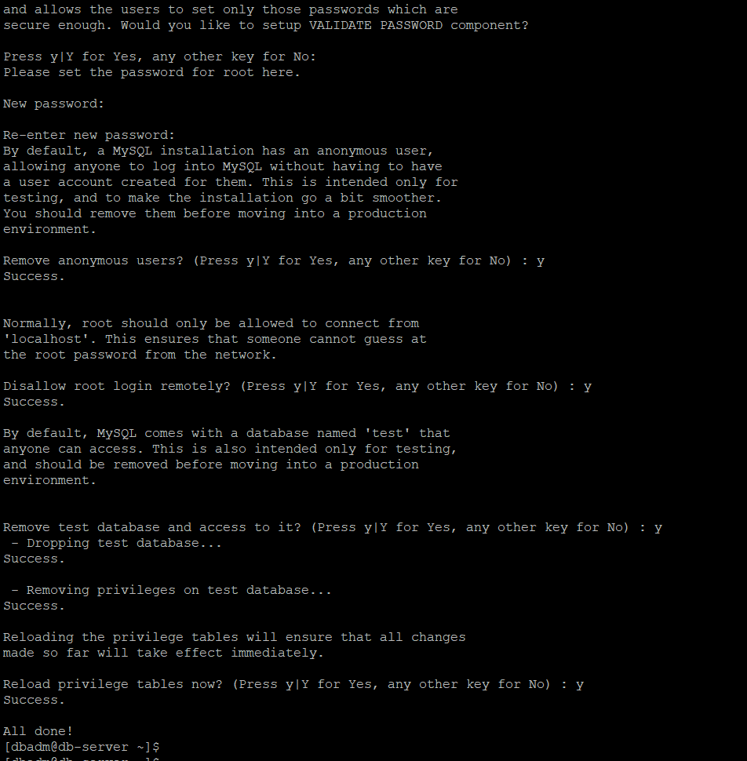

# Application Migration from On\-Premises to AWS


## Objective:

Consider that we have an application currently running on an on-premises server.  
Example:

**Application Server:**

```
RHEL OS
4 vCPU
16 GB RAM
200 GB disk
Java/Tomcat application
```

**Database Server:**

```bash
RHEL
4 vCPU
16 GB RAM
500 GB disk
MySQL database
```


```
Assume the requirement is to move this application to AWS.
Prepare a simple migration approach and implement it in a lab environment.
You should identify:
Target AWS services
EC2 sizing
Network requirements
Storage requirements
Security requirements
Database migration approach
DNS/application configuration changes
Backup and monitoring
Validation after migration
Rollback approach
Also explain whether you would choose rehost, replatform or another approach and why.
As an additional exercise, think about how you would handle the migration if the database was very large and downtime had to be minimized.
```
Sample project repo used -  https://github.com/jaygajera17/E-commerce-project-springBoot.git


# High Level Flow


Target Production flow:

`User -> Route53 -> ALB -> EC2 App -> RDS [Private DB]`

# Prepare VMs

> 1. Intall Virtualbox from oracle site.
> 2. Visit the rhel website , download image with image builder or direct available iso file(need sign up)
> 3. Enable NAT, host only adopter in network of VirtualBox and install and enable sshd service, copy ip address and connect both server with putty.


On **BOTH VMs**, do this in RHEL 10 terminal:

#### Set hostname and static IP for host-only network.
command to set hostname:

```bash
sudo hostnamectl set-hostname app-server        # in app-server VM
sudo hostnamectl set-hostname mysql-server      # in mysql-server VM

# logout and login again to see hostname change
```

**1. Find Host-Only interface name:**

```bash
nmcli device status
```

It will be like `enp0s8` (NAT is enp0s3). Note it.

**2. Set static IP:**
Replace `enp0s8` with your actual name from step 1 below. 

**On app-server (192.168.56.xx):**

```bash
sudo nmcli con add type ethernet ifname enp0s8 con-name hostonly ip4 192.168.56.xx/24
# Connection 'hostonly' (36adb0c5-f1fb-4525-b874-35dc08cd96cf) successfully added.
sudo nmcli con up hostonly
# Connection successfully activated (D-Bus active path: /org/freedesktop/NetworkManager/ActiveConnection/4)
```
Similarly,

**On mysql-server (192.168.56.xx):**

```bash
sudo nmcli con add type ethernet ifname enp0s8 con-name hostonly ip4 192.168.56.xx/24
sudo nmcli con up hostonly
```

>[!NOTE]
**nmcli = command-line tool to control NetworkManager (manage network connections/IP).**
**Other useful commands:**
nmcli device status
nmcli connection show
nmcli con up <name>
nmcli con down <name>
nmcli device wifi list
nmcli device wifi connect <SSID> password <pass>
nmcli con add type ethernet con-name my-lan ifname eth0 ip4 192.168.1.10/24 gw4 192.168.1.1 
nmcli con mod <name> ipv4.dns "8.8.8.8 8.8.4.4"

**3. Verify:**

```bash
ip a
ping 192.168.56.11  # from app-server
ping 192.168.56.10  # from mysql-server
```

If ping works, done.

---

# On-Prem DB setup

#### Install mysql 8.4-server

```bash
sudo dnf install mysql8.4-server
```


#### Enable mysqld server

```bash
sudo systemctl enable --now mysqld
    systemctl status mysqld

```

#### Run secure installation setup, almost all option y , set password here(save root password in this step)

```bash
sudo mysql_secure_installation
```


>Here i have bypassed the password validation plugin for simplicity, but in production, you should use strong passwords and enable validation.

#### Login to database and create sample user and tables for project

```bash
sudo mysql -u root -p
```


```sql
SET SQL_MODE ='IGNORE_SPACE,ERROR_FOR_DIVISION_BY_ZERO,NO_ENGINE_SUBSTITUTION';

CREATE DATABASE IF NOT EXISTS ecommjava; for this project
CREATE USER 'appuser'@'%' IDENTIFIED BY 'App@12345';

GRANT ALL PRIVILEGES ON ecommjava.* TO 'appuser'@'%';
FLUSH PRIVILEGES;


USE ecommjava;
# create the category table
CREATE TABLE IF NOT EXISTS CATEGORY(
category_id int unique key not null auto_increment primary key,
name        varchar(255) null
);

# insert default categories
INSERT INTO CATEGORY(name) VALUES ('Fruits'),
                                  ('Vegetables'),
                                  ('Meat'),
                                  ('Fish'),
                                  ('Dairy'),
                                  ('Bakery'),
                                  ('Drinks'),
                                  ('Sweets'),
                                  ('Other');
# create the customer table
CREATE TABLE IF NOT EXISTS CUSTOMER(
id       int unique key not null auto_increment primary key,
address  varchar(255) null,
email    varchar(255) null,
password varchar(255) null,
role     varchar(255) null,
username varchar(255) null,
UNIQUE (username)
);

# insert default customers
INSERT INTO CUSTOMER(address, email, password, role, username) VALUES
                                                                   ('123, Albany Street', 'admin@nyan.cat', '123', 'ROLE_ADMIN', 'admin'),
                                                                   ('765, 5th Avenue', 'lisa@gmail.com', '765', 'ROLE_NORMAL', 'lisa');
                                                                   # create the product table
CREATE TABLE IF NOT EXISTS PRODUCT(
product_id  int unique key not null auto_increment primary key,
description varchar(255) null,
image       varchar(255) null,
name        varchar(255) null,
price       int null,
quantity    int null,
weight      int null,
category_id int null,
customer_id int null
);

# insert default products
INSERT INTO PRODUCT(description, image, name, price, quantity, weight, category_id) VALUES
                                                                                        ('Fresh and juicy', 'https://freepngimg.com/save/9557-apple-fruit-transparent/744x744', 'Apple', 3, 40, 76, 1),
                                                                                        ('Woops! There goes the eggs...', 'https://www.nicepng.com/png/full/813-8132637_poiata-bunicii-cracked-egg.png', 'Cracked Eggs', 1, 90, 43, 9);


# create indexes
CREATE INDEX FK7u438kvwr308xcwr4wbx36uiw
    ON PRODUCT (category_id);

CREATE INDEX FKt23apo8r9s2hse1dkt95ig0w5
    ON PRODUCT (customer_id);

```

>[!Note]
> 1. Use the pre existing query provided with project file for project related database creation.
> 2. @'%' means allow appuser to connect from ANY host/IP (anywhere on internet), not just localhost.

#### Allowed connection

```bash
sudo vi /etc/my.cnf.d/mysql-server.cnf

# Add under [mysqld]:
bind-address=0.0.0.0
```

#### Restart mysql service


```bash
sudo systemctl restart mysqld
```

#### Open port 3306

```bash
sudo firewall-cmd --add-port=3306/tcp --permanent 2>/dev/null || echo "firewalld off - ok"
# checking 
sudo firewall-cmd --reload                          # Reload firewall to apply latest changes
sudo firewall-cmd --state                           # check firewall status
sudo firewall-cmd --list-all                        # list all rules
```


#### Test into db server


```sql
 mysql -u appuser -p -h 192.168.56.106 ecommjava -e "SELECT * FROM CATEGORY;"
```

# On-prem Application setup


#### login to app server using ssh

1. **Install Java + Maven + Git:**

```bash
sudo dnf install -y java-21-openjdk-devel maven git
java -version
mvn -version
```

1. **Clone and configure DB:**

```bash
cd /opt
sudo git clone https://github.com/jaygajera17/E-commerce-project-springBoot.git ecom
sudo chown -R $USER: ecom
cd ecom

# Edit DB config
vi src/main/resources/application.properties

db.url=jdbc:mysql://192.168.56.xx:3306/ecommjava?createDatabaseIfNotExist=true
db.username=appuser 
# Use the AWS Secret Manager or Parameter Store for production instead of hardcoding passwords.
db.password=App@12345
db.driver=com.mysql.cj.jdbc.Driver
```


#### Check the connectivity by installing mysql client

`mysql -h 192.168.56.11 -u appuser -p -e "SHOW DATABASES;"`

Add firewall rule for accessing in browser

```bash
sudo firewall-cmd --add-port=8080/tcp --permanent
sudo firewall-cmd --reload
sudo firewall-cmd --list-all
```
>[!NOTE]
Port **80 is the default port for HTTP** traffic, while port **8080** is an alternative often used for **development**, proxies, or when port 80 is blocked or requires admin **privileges**. They can both serve web content, which is why developers sometimes use them interchangeably.


#### Compile and Run Application 

```bash
mvn clean install -DskipTests
java -jar target/*.jar
```
>[!NOTE]
📖 Command: `mvn clean install -DskipTests`  
**mvn** → Runs Maven, the build automation tool.  
**clean** → Deletes the **target/** directory (removes old compiled files, JARs, classes, etc.) so the build starts fresh.  
**install** → Compiles the code, runs tests (unless skipped), packages it (JAR/WAR), and installs the artifact into your local Maven repository (~/.m2/repository). This makes it available for other projects on your machine.  
**-DskipTests** → A system property telling Maven to skip running tests during the build.  
Here tests are compiled but not executed.  
Useful when you want faster builds or when tests are failing but you still need the artifact.  
**Key Difference in Both type of Skip**  
**-DskipTests** → Compiles tests but doesn’t run them.  
**-Dmaven.test.skip=true** → Skips both compiling and running tests (even faster, but riskier)  
**When to use**  
✅ Development builds: Speeds up iteration when you don’t need to run tests every time.  
✅ CI/CD pipelines: Sometimes used in early stages to just build artifacts.  
⚠️ Not recommended for production releases: Skipping tests means you risk deploying buggy code.  


App will run on `http://192.168.56.xx:8080`

**Test:** Open `http://192.168.56.xx:8080` from your laptop browser.

#### Make the service so that can be manage by systectl command

```bash
# Note Path of your application
pwd
# example: /opt/ecom
# List Jar file and note the eaxct full name.

ls /opt/ecom/target/*.jar

```

1. **Create systemd service:**

```bash
# Create service file and paste below.
sudo vi /etc/systemd/system/ecomm.service

[Unit]
Description=E-commerce Java App
After=network.target mysqld.service
Wants=mysql-server

[Service]
User=<YOUR APP USERNAME>
WorkingDirectory=/opt/ecom
ExecStart=/usr/bin/java -jar /opt/ecom/target/JtSpringProject-0.0.1-SNAPSHOT.jar
Restart=always
RestartSec=10
SuccessExitStatus=143

[Install]
WantedBy=multi-user.target
```


   2. **Enable & Start Service ecomm:**
```bash
sudo systemctl daemon-reload              # Reload systemd manager configuration
sudo systemctl enable ecomm               # Enable newly created service to start on boot
sudo systemctl start ecomm                # Start the service immediately
sudo systemctl status ecomm               # Check the status of the service
sudo journalctl -u ecomm -f               # Follow the logs of the service in real-time
```

Now close terminal, app will still run on `http://192.168.56.10:8080`

To restart after code change: `sudo systemctl restart ecomm`

>[!NOTE]
Your application is now running as a **systemd service**. This means it will automatically start on boot, can be managed using `systemctl` commands, and will restart if it crashes. You can check its status, view logs, and control it just like any other service on your system.
---
Pre migration checklist:
```bash
# On App Server
cat /etc/os-release
free -h
df -h
java -version
/opt/tomcat/bin/version.sh

# On DB Server
df -h
mysql -u appuser -p -e "SELECT VERSION(); SHOW DATABASES; SELECT COUNT(*) FROM myappdb.users;"

# Note down:
# 1. Application URL
# 2. DB Connection String
# 3. Disk usage
```

# Migration Process:

### 1. Migration Strategy
For this senario, we will use two strategies for migration:
1. **Rehost**: Move as-is Both MVs to EC2

2. **Replatform :** Move EC2 mysql server to Amazon RDS for MySQL. i.e. small change and swap the database to managed service.

>**Refactor / Rearchitect**: Rewrite to Cloud Native(not applicable in this case)


 we will migrate the srever in two phases as below:

 ***Phase 1: Pure Rehost** -\> App on EC2 + DB on EC2. Prove app works in AWS.*

***Phase 2: Replatform** -\> Keep App on EC2 + Move DB to Amazon RDS for MySQL.*

---

### 2. Target Architecture on AWS


**Target AWS Services:**

- **Compute:** Amazon EC2 for App Server in Phase 1 and Phase 2.
- **Database:** Amazon RDS for MySQL in Phase 2
- **Network:** Amazon VPC, Subnets, Internet Gateway
- **Storage:** Amazon EBS, Amazon S3 for artifacts/backups gp3
- **Security:** Security Groups, IAM Roles, AWS Secrets Manager(not using here due to free tier), AWS KMS(encript/decript the data in transit)
- **DNS:** Amazon Route 53(not using here due to free tier and demo purpose)
- **Monitoring & Backup:** Amazon CloudWatch, AWS CloudTrail, AWS Backup, RDS Automated Backups(not using here due to free tier and demo purpose)
- **Migration Tool:** AWS Application Migration Service or simple rsync/mysqldump, and AWS DMS for large DB case

## Steps:

**1. Create VPC in two AZs**
name: prod-migration

2 public , 2 private subnets
**Rename later**
```bash
prod-migration-private-1a   # for Database EC2 in first phase, later for RDS in second phase
prod-migration-private-1b     # for RDS in second phase to replicate in second AZ to create DB Subnet Group
prod-migration-public-1a        # for Application EC2 in first phase and migation staging area
prod-migration-public-1b       # for Application EC2 in second AZ for HA(not used in this lab)
```

### create SGs

**SG 1:**`mgn-replication-sg`

- **VPC:** your prod-migration-vpc
- **Inbound:** Add rule -\> 
 `Type: Custom TCP -> Port: 1500 -> `
 `Source: only the private CIDR(s) or specific IP addresses of the on-premises source servers that will be replicated to AWS.`

 Example: `Type: Custom TCP -> Port: 1500 -> Source: 172.16.0.0/32`

- **Outbound**: All (default)

**SG 2:**`app-sg`

- **VPC:** same
- **Inbound:**  
Rule1: SSH - Port 22 - Source: My IP  
Rule2: Custom TCP - 8080 - Source: My IP later 0.0.0.0/0
- **Outbound:** Default All

**SG 3:**`db-sg`

- **VPC:** same
- **Inbound:**  
Rule1: SSH - 22 - My IP  
Rule2: MYSQL/Aurora - 3306 - Source: `app-sg` [select app-sg in dropdown, not IP]
- **Outbound:** All


### Create IAM User

IAM -\> Users -\> Create User

- Name: `mgn-agent-user`
- Check: Provide user credentials -\> I want to create IAM user
- Permissions: Attach policies directly -\> Search `AWSApplicationMigrationAgentPolicy` -\> Check it
- Create User -\> Go to Security credentials -\> Create access key -\> Choose `Other` -\> Create -\> **COPY Access Key ID + Secret Key**

### Initialize MGN

Go to **MGN -\> Source servers -\> Get Started**

Click **Initialize** - Wait 2 min - It will create `AWSApplicationMigrationServiceRole` automatically.

After init:

1. Go to MGN -\> **Settings -\> Replication Template -\> Edit**
    - Staging area subnet: Select your PUBLIC subnet (10.0.1.0/24)
    - Staging area SG: `mgn-replication-sg`
    - Save template
2. Go to **Settings -\> Launch Template -\> Edit**
    - Instance type: `t3.medium` [or t2.micro for free tier]
    - Leave everything else default -\> Saves
3. Go to Source Servers -> Add servers
   It will show you install command for RHEL.

#### On your 2 On-Prem VMs [app-server and db-server]:

> It will prompt for which disks to replicate -enter for all disks.

```bash
# 1. Download the agent installer script
wget -O aws-replication-installer-init https://aws-application-migration-service-<region>.s3.<region>://

# 2. Make the installer executable and run it with your AWS credentials
sudo chmod +x aws-replication-installer-init
sudo ./aws-replication-installer-init \
  --region <region> \
  --aws-access-key-id <AWS_ACCESS_KEY_ID> \
  --aws-secret-access-key <AWS_SECRET_ACCESS_KEY>

```

Now in MGN Console, both servers will show Replication -> Initial sync. Wait 30-40 min.

To check the status of replication service
`sudo systemctl status aws-replication-agent -l`

**Once Ready for testing:**

MGN -> Test and Cutover -> Launch test instances.
It will launch 2 EC2s exactly like your RHEL VMs - same Java, MySQL, App.
Verify http://test-ec2-ip:8080
If ok: Cutover -> Final Cutover - it terminates on-prem.

That's pure Rehost done.


# Error


# Challenges:
